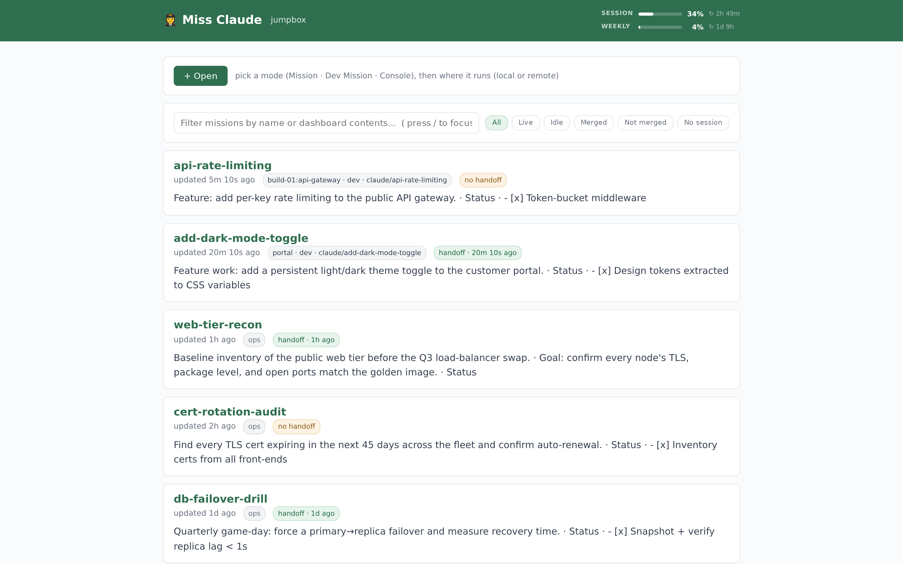
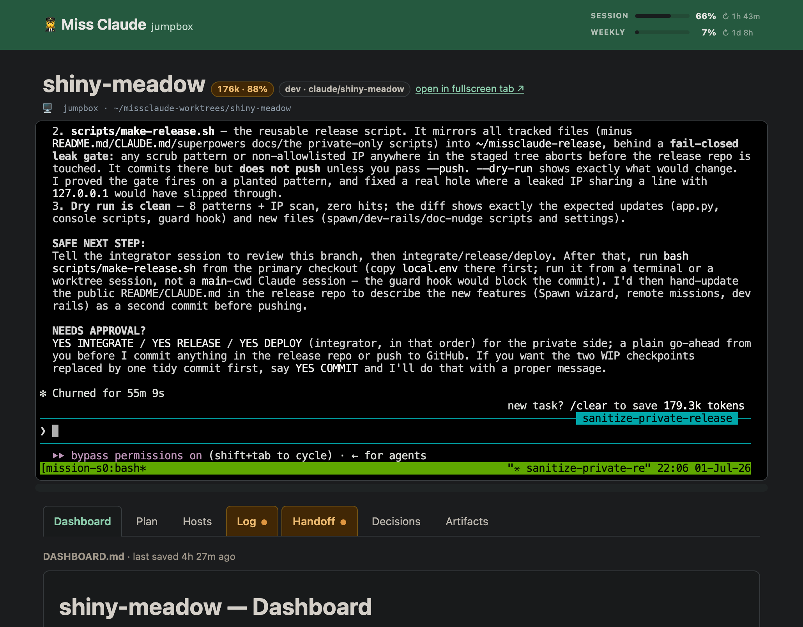
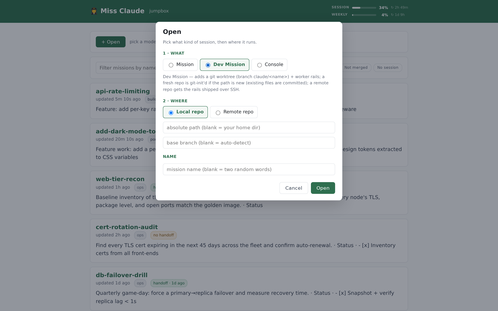

HUMAN Text:

So this is claude cli wrapped in a webui.  You cant lose a session.  You cant get disconnected.  Claude updates files in the webui with actions taken / info gathered.

What this helps fix:

* getting disconnected from ssh when running claude
* change from dialup to wifi? move to a new hotspot? restart computer?  Everything stays just where you left it, and claude keeps running.
* losing long claude sessions
* losing important context
* scrolling/reading through claude output to figure out what it did/didnt do
* not being able to find that ONE claude that had the THING i need.
* claude stopping working because laptop closed/computer went to sleep
* Spending days trying claude management software that is shitty, overcomplicated, and still didn't meet the minimum requirements of what I wanted -^
* being unable to copy/paste large text blocks out of claude

Claudes are Searchable by name + context.
Run claude on remote servers - fully resumable with context.
Optional full screen web page console.

Webui displays:

* session / weekly Claude usage limits
* color coded Context usages in every window/claude so you know when to /compact or /clear.
* Dashboard, Plan, Handoff, Log, Descisions, Artifcats files per claude instance.
* all / commands are unchanged.  Claude interface itself is unchanged.  /clear is normal, but this keeps important context in the files -^ which auto-update when claude does something significant.


**Insane Claude install prompt:**

> Install github.com/apezio/miss-claude on port 12000, bound to 0.0.0.0, no token, firewall open.
> Read the repo README. Run it and give me the public URL and the login/pass.

**Sane Claude install prompt:**

> Install github.com/apezio/miss-claude on port 12000. Read the repo README for how. Use the systemd
> production setup (setup.sh), keep it bound to localhost, set a MISSION_TOKEN and a strong console
> password, and don't touch the firewall. Give me the local URL, the token, and how to reach it over
> an SSH tunnel.

ALL AI GENERATED BELOW THIS POINT.
---

# Miss Claude

A tiny, dependency-free web UI for running ops **"missions"** on a single Linux host — with a
real `claude` terminal embedded in every mission page. You can't lose a session, can't get
disconnected, and Claude keeps its own notes in markdown files as it works.



## What it is

A mission is just a directory of markdown files. Miss Claude views/edits them in the browser and
pins a live, resumable Claude Code console (the actual CLI, over a websocket) at the top of each
mission. Close the tab, switch networks, reboot — you land back exactly where you left off.

Built with the **Python 3 standard library only**: no pip, no venv, no Node, no database, no
internet. System `python3` (3.9+) is the sole hard dependency. (The console also uses
[`ttyd`](https://github.com/tsl0922/ttyd) + `tmux` + the `claude` CLI.)

## Why

- **No lost work.** `tmux` keeps every session alive across SSH drops, network changes, sleep, and reboots.
- **Files as truth.** Missions are folders of markdown — grep, diff, edit, and sync them with any tool.
- **A real console, not a chat box.** Slash commands, plan mode, permission prompts — the actual `claude` TUI in the browser, and copy/paste that just works.
- **Searchable.** Find the Claude that had the thing you need by name or dashboard contents.
- **Remote-capable.** Run Claude on remote servers, fully resumable.
- **At-a-glance status.** Session/weekly usage bars plus colour-coded per-console context, so you know when to `/compact` or `/clear`.
- **Zero build.** One `app.py`. Clone and run.

## A mission page

A live Claude console on top; markdown tabs below — **Dashboard · Plan · Hosts · Log · Handoff ·
Decisions · Artifacts**. Claude updates the files as it works, and a tab highlights when its file
changes, without reloading the terminal.



> **Copying text from the console:** if you highlight text in the console and can't copy it, Claude
> Code's mouse capture is grabbing the selection. Turn it off so your terminal handles
> scroll/selection and copy natively — add to your `~/.bashrc`:
>
> ```bash
> # Disable mouse capture in Claude Code (lets the terminal handle scroll/selection)
> export CLAUDE_CODE_DISABLE_MOUSE=1
> ```

Each mission is just a folder:

```
~/missions/<name>/
  DASHBOARD.md PLAN.md HOSTS.md LOG.md HANDOFF.md DECISIONS.md
  artifacts/  scans/  mission.json   # optional sidecar: where the console runs
```

## Open a mission

The **+ Open** wizard picks a **mode** — Mission (ops docs + a console), Dev Mission (also creates
a `git worktree` + worker guardrails), or Console (a stateless session) — then **where** it runs:
local or remote (`host` + `dir`).



## Prerequisites

- **`python3` 3.9+** — the only hard dependency of the dashboard itself.
- **For the in-browser console:** [`ttyd`](https://github.com/tsl0922/ttyd), `tmux`, and the
  `claude` CLI, all on `PATH`. Without them the dashboard still loads, but every **Console tab points
  at a port with nothing listening and shows "refused to connect."** A fresh box usually has `tmux`
  but **not `ttyd`** — install it:

  ```bash
  # RHEL / Alma / Rocky 9 — ttyd lives in EPEL, so enable EPEL first:
  sudo dnf install -y epel-release && sudo dnf install -y ttyd tmux
  # Debian / Ubuntu:
  sudo apt install -y ttyd tmux          # or grab the static binary from ttyd's releases page
  ```

  (`setup.sh` preflights these tools, detecting your package manager and running this install for
  you — it fails with the exact command if anything's missing; installing the `claude` CLI is on you.)

## Quick start

```bash
git clone https://github.com/apezio/miss-claude ~/mission-dashboard
cd ~/mission-dashboard
./dev-run.sh          # runs BOTH the dashboard and the console bridge
# open the dashboard URL it prints (default http://127.0.0.1:4200/)
```

The UI needs **two** processes: the dashboard (`app.py`) and a *separate* `ttyd` console bridge on
`CONSOLE_TTYD_PORT` (default **4201**) that the browser iframes **directly**. Starting only
`python3 app.py` is the classic trap — the dashboard loads, but every Console tab says "refused to
connect" because nothing is serving the console port. **`dev-run.sh`** avoids that: it starts both,
binds them to `127.0.0.1`, generates and prints a random console password (never credential-less),
fails loudly if `python3`/`tmux`/`ttyd`/`claude` is missing, and stops both together on Ctrl-C. It's
the dev path only — the real deployment is systemd (below).

For a real install (systemd units for **both** services + the console prerequisites), preview then
run:

```bash
cd ~/mission-dashboard
sudo bash setup.sh --dry-run   # prints exactly what it will write; changes nothing
sudo bash setup.sh             # installs + enables both services (prompts for the console password)
```

The dashboard ends up on `:4200`, the console on `:4201`. See `setup.sh --help` for flags
(`--user`, `--label`, `--token`, `--no-console`, …).

## Exposing it beyond localhost

> ⚠️ **Security — read this before binding to `0.0.0.0`.** The dashboard has **no auth by default**
> (`MISSION_TOKEN` unset), and the console is an interactive shell running
> `claude --dangerously-skip-permissions`. Exposing *either* port to the network without protection
> is **remote command execution as the user the services run as.** Before widening the bind address:
>
> - Set **`MISSION_TOKEN`** on the dashboard (see [Configuration](#configuration)).
> - Always give `ttyd` a strong **`--credential`**. The systemd template ships a
>   `CHANGE-ME-STRONG-PW` placeholder in `claude-console.service` — change it. Never run the console
>   credential-less.
> - Prefer pinning the firewall to **your own source IP** over opening to the world.

The dashboard binds `127.0.0.1` by default. To reach it from another machine set
`MISSION_HOST=0.0.0.0`, then open **both** ports — the dashboard port **and** the console port
(4201) — because the browser hits the console listener directly; opening only the dashboard port
leaves the console dead from outside:

```bash
sudo firewall-cmd --permanent --add-port=4200/tcp   # dashboard
sudo firewall-cmd --permanent --add-port=4201/tcp   # console (CONSOLE_TTYD_PORT)
sudo firewall-cmd --reload
```

## Configuration

All optional; the common ones:

| Variable | Default | Meaning |
|---|---|---|
| `MISSION_PORT` | `4200` | Port the dashboard listens on. |
| `MISSION_HOST` | `127.0.0.1` | Bind address; `0.0.0.0` to listen on all interfaces (see [Exposing it](#exposing-it-beyond-localhost)). |
| `CONSOLE_TTYD_PORT` | `4201` | Port of the `ttyd` console bridge the browser iframes. |
| `MISSIONS_DIR` | `~/missions` | Where mission directories live. |
| `MISSION_TOKEN` | _(unset)_ | If set, requests need `?token=…` (then a cookie). |
| `MISSION_LABEL` | _(unset)_ | Short label shown beside the title. |

## Contributing

An optional multi-session role/branch workflow lets several Claude sessions develop the dashboard
at once without stepping on each other, enforced by a `PreToolUse` hook — you don't need any of it
to *use* Miss Claude. See [`CLAUDE.md`](CLAUDE.md) and
[`docs/WORKFLOW_ROLES.txt`](docs/WORKFLOW_ROLES.txt).

No build, no test framework: syntax-check `app.py`, run a throwaway instance on a spare port with a
temp `MISSIONS_DIR`, and `curl` it.
