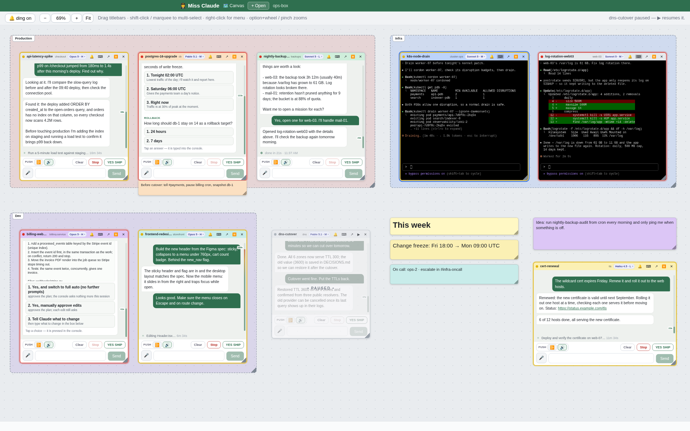
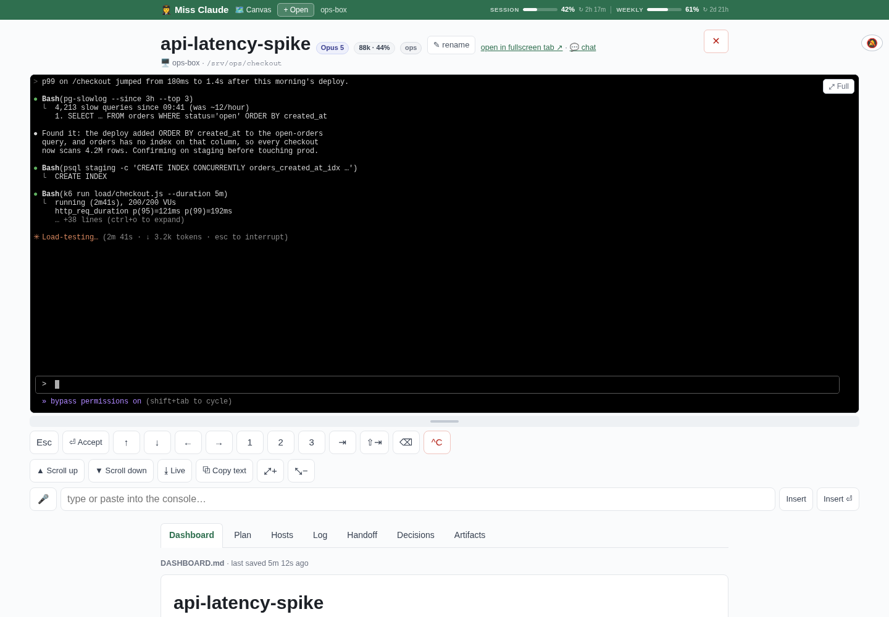
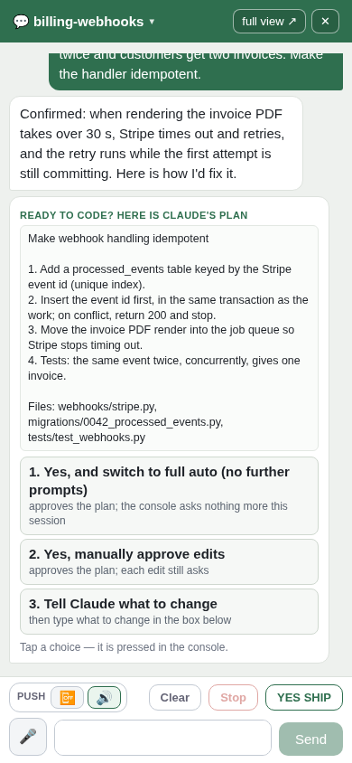
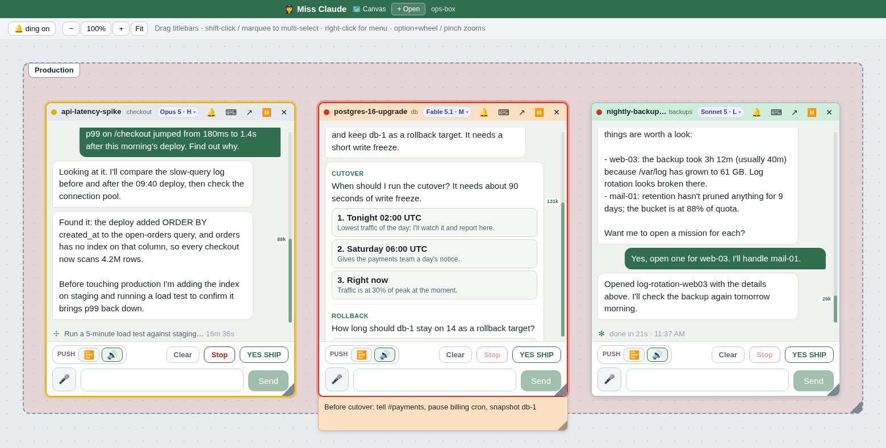
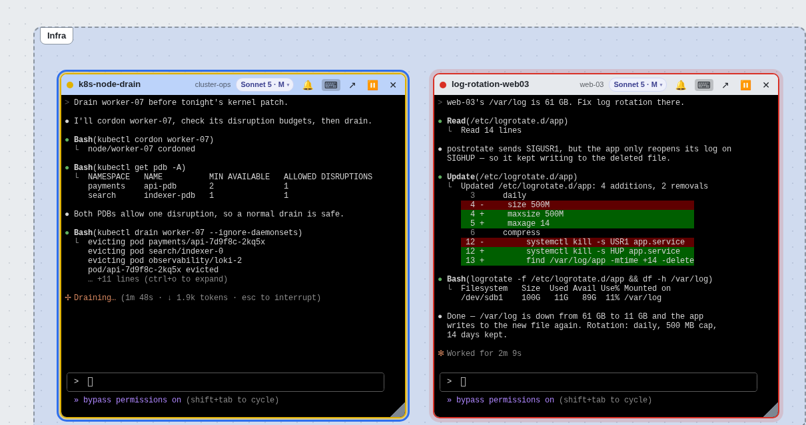
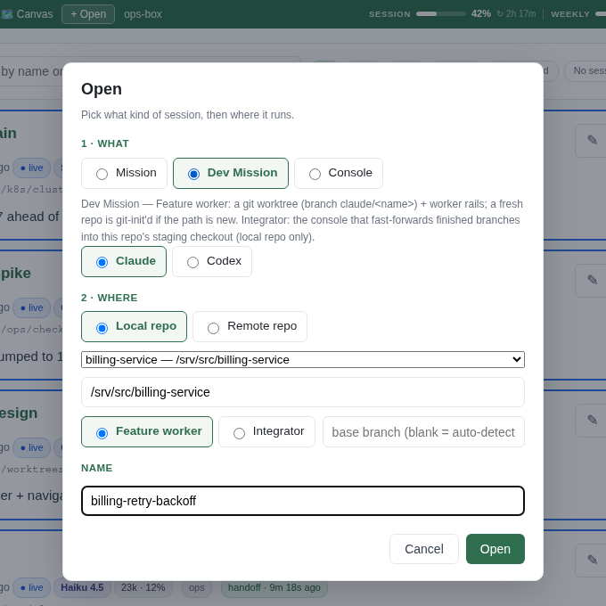
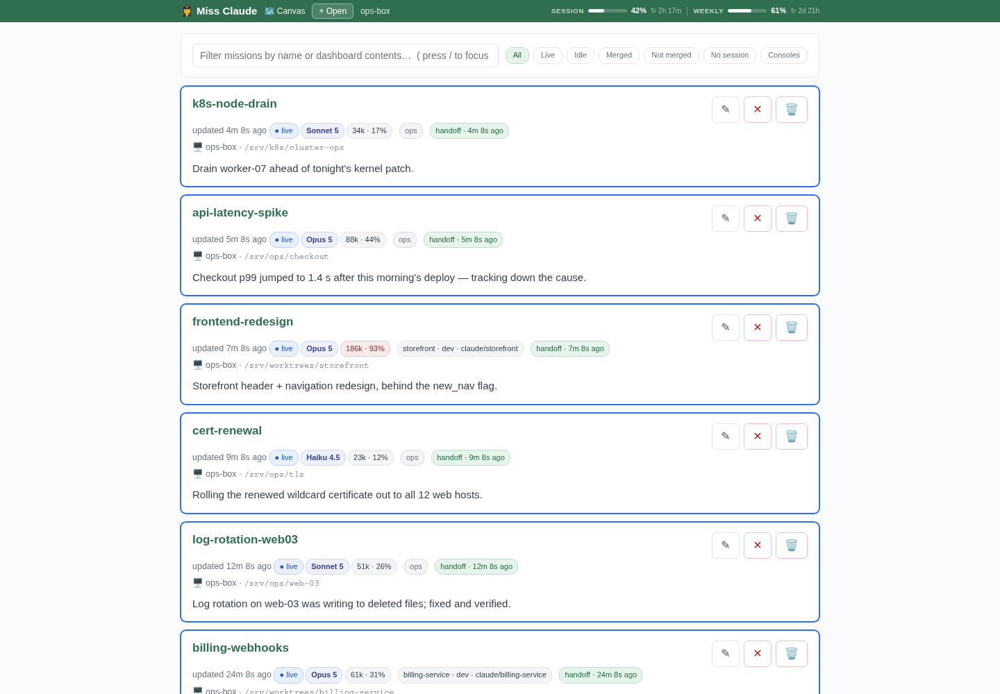

HUMAN Text:

So this is claude cli wrapped in a webui.  You cant lose a session.  You cant get disconnected.  Claude updates files in the webui with actions taken / info gathered.

What this helps fix:

* getting disconnected from ssh when running claude
* change from dialup to wifi? move to a new hotspot? restart computer?  Everything stays just where you left it, and claude keeps running.
* losing long claude sessions
* losing important context
* scrolling/reading through claude output to figure out what it did/didnt do
* not being able to find that ONE claude that had the THING i need.
* claude stopping working because laptop closed/computer went to sleep
* Spending days trying claude management software that is shitty, overcomplicated, and still didn't meet the minimum requirements of what I wanted -^
* being unable to copy/paste large text blocks out of claude

Claudes are Searchable by name + context.
Run claude on remote servers - fully resumable with context.
Optional full screen web page console.

Webui displays:

* session / weekly Claude usage limits
* color coded Context usages in every window/claude so you know when to /compact or /clear.
* Dashboard, Plan, Handoff, Log, Descisions, Artifcats files per claude instance.
* all / commands are unchanged.  Claude interface itself is unchanged.  /clear is normal, but this keeps important context in the files -^ which auto-update when claude does something significant.


**Insane Claude install prompt:**

> Install github.com/apezio/miss-claude on port 12000, bound to 0.0.0.0, no token, firewall open.
> Read the repo README. Run it and give me the public URL and the login/pass.

**Sane Claude install prompt:**

> Install github.com/apezio/miss-claude on port 12000. Read the repo README for how. Use the systemd
> production setup (setup.sh), keep it bound to localhost, set a MISSION_TOKEN and a strong console
> password, and don't touch the firewall. Give me the local URL, the token, and how to reach it over
> an SSH tunnel.

ALL AI GENERATED BELOW THIS POINT.
---

# Miss Claude

A tiny, dependency-free web UI for running ops **"missions"** on a single Linux host — with a
real `claude` terminal embedded in every mission page. You can't lose a session, can't get
disconnected, and Claude keeps its own notes in markdown files as it works.



<sub>Screenshots are from a demo instance with made-up missions.</sub>

## What it is

A mission is just a directory of markdown files. Miss Claude views/edits them in the browser and
pins a live, resumable Claude Code console (the actual CLI, over a websocket) at the top of each
mission. Close the tab, switch networks, reboot your laptop — you land back exactly where you left off.

Built with the **Python 3 standard library only**: no pip, no venv, no Node, no database, no
internet. System `python3` (3.9+) is the sole hard dependency. (The console also uses
[`ttyd`](https://github.com/tsl0922/ttyd) + `tmux` + the `claude` CLI.)

## Why

- **No lost work.** `tmux` keeps every session alive across SSH drops, network changes, sleep, and
  browser reloads; a stopped session resumes its conversation when you reopen it.
- **Files as truth.** Missions are folders of markdown — grep, diff, edit, and sync them with any tool.
- **A real console, not a chat box.** Slash commands, plan mode, permission prompts — the actual
  `claude` TUI in the browser. (There's a chat view too, for phones and the canvas.)
- **See every Claude at once.** The canvas shows each live session as a card that turns yellow while
  it works and red — with a ding — when it's waiting on you.
- **Searchable.** Find the Claude that had the thing you need by name or dashboard contents.
- **Remote-capable.** Run Claude on remote servers, fully resumable.
- **At-a-glance status.** Session/weekly usage bars plus colour-coded per-console context, so you
  know when to `/compact` or `/clear`.
- **Zero build.** One `app.py`. Clone and run.

## What's new

Everything added since the first public release, in one place (each is covered below):

- **Canvas** (`/canvas`) — a spatial dashboard: every live mission is a draggable card with its
  chat embedded, coloured by what Claude is doing, with groups, notes, zoom and a "waiting" ding.
- **Chat view** (`/m/<name>/chat`) — a phone-friendly chat over the same console: bubbles, tappable
  answers to Claude's questions and plans, dictation, a mission picker, a ▶ Start button.
- **Installable app** — a web-app manifest + icons, so Chrome offers *Install*.
- **HTTPS by default** — `setup.sh` builds a small local CA and serves both ports over TLS, with a
  `/ca.crt` download and an http→https redirect.
- **Codex** — any mission or console can run `codex` instead of `claude`.
- **Dev missions on any repo**, local or remote, with an optional **integrator** role, a repo
  picker, auto-detected base branch and auto-`git init` for new paths.
- **One-approval shipping** — a finished branch ships on a single `YES SHIP` through
  `scripts/miss-ship.py` (integrate → push → release → deploy → verify, resumable).
- **Rename ✎, queued delete 🗑** (moved to an archive, undoable for 60 s), and **auto-naming** of
  missions spawned with a blank name — Claude names them from your first prompt.
- **Index upgrades** — filter pills, context badge + model per card, plan-usage card, card blurbs,
  "Show more" paging, lighter tiered polling.
- **Console upgrades** — a touch key bar for phones, copy/paste via tmux, height controls and a Full
  toggle, a trackpad-scroll fix, and per-console cgroups so a stopped console leaves no stray
  processes.
- **Idle reaping** — a session nobody has touched for 24 h is stopped cleanly (reopening resumes it).
- **Push notifications** (optional, [Bark](https://github.com/Finb/Bark)) per mission via a 🔔 toggle.
- **Director mode** (experimental) — one mission that writes specs, launches others and reports a board.
- **Contributor tooling** — `scripts/check` (syntax + full unittest suite), `scripts/dev-instance`,
  `scripts/status`, `scripts/outline`.

## A mission page

A live Claude console on top; markdown tabs below — **Dashboard · Plan · Hosts · Log · Handoff ·
Decisions · Artifacts**. Claude updates the files as it works; the tabs load *below* the console
without reloading it, poll for changes, and highlight when their file changes.



Each mission is just a folder:

```
~/missions/<name>/
  DASHBOARD.md PLAN.md HOSTS.md LOG.md HANDOFF.md DECISIONS.md
  artifacts/  scans/  mission.json   # optional sidecar: where/how the console runs
```

Create missions from the UI (below) or just `mkdir ~/missions/<name>` — both work.

### The console

- **tmux is the persistence layer.** Each mission's Claude runs in a tmux session
  (`mission-<name>`) behind one `ttyd` bridge; reloading or reconnecting lands you in the same live
  session with scrollback intact. When a console is stopped (✕, pause, idle reap), reopening it
  **resumes the conversation**.
- **On a phone or tablet** the console has a **key bar** for what a touch keyboard lacks — Enter,
  Tab, Shift-Tab (Claude's mode), Backspace, Esc, arrows, Ctrl-C — plus scrollback, **copy out** /
  **paste in** via tmux, taller/shorter buttons and a dictation field.
- **Height:** 55 % of the window by default; drag the grip up to 4× the window. **⤢ Full** toggles
  between the maximum and the default.
- **Trackpad scrolling** over the console scrolls the page instead of walking Claude's prompt
  history. (ttyd is served from a patched copy of its own page — `scripts/make-console-index.sh` —
  that declines the wheel events xterm.js would otherwise turn into Up/Down keys.)
- **No stray processes.** Each console pane gets its own cgroup, so stopping it also ends anything
  it backgrounded (dev servers started with `nohup`, browser test runners, …).

> **Copying text from the console:** if you highlight text in the console and can't copy it, Claude
> Code's mouse capture is grabbing the selection. Turn it off so your terminal handles
> scroll/selection and copy natively — add to your `~/.bashrc`:
>
> ```bash
> # Disable mouse capture in Claude Code (lets the terminal handle scroll/selection)
> export CLAUDE_CODE_DISABLE_MOUSE=1
> ```

## The chat view



`/m/<name>/chat` is the same console as a chat: your prompts and Claude's replies as bubbles, a
text box that types into the live session, and the buttons a phone needs — **Stop**, **Clear**
(double-click; sends `/clear`), 🎤 dictation, and a **YES SHIP** button that sends the shipping
approval.

When Claude asks you something (`AskUserQuestion`), the options are buttons; a plan
(`ExitPlanMode`) shows the plan with Claude's approve / keep-planning choices as buttons.

A **mission picker** in the header jumps between missions (most recently active first), a
**▶ Start it** button starts a stopped console, and an unsent draft is kept per console in the
browser. It's also what the canvas embeds.

<br clear="right">


## The canvas

**🗺 Canvas** in the header opens a spatial dashboard. Every mission with a live console is a card —
a titlebar over that mission's chat view:

- **State colour** from the live transcript: **yellow** = working, **red** = waiting on you (with a
  synthesized ding when it flips; mute toggle in the bar), grey = no Claude running. A question or
  plan awaiting your answer counts as waiting. Red clears once you click into that card's chat.
- **Titlebar controls:** ⌨ swap to the raw terminal · ↗ open full view · ▶ start / ⏸ pause (the card
  keeps its last conversation under a veil) · ✕ remove · a **model menu** that sends `/model <id>`
  (choices from `MISSION_MODELS`).
- **Context rail** up the right edge of each card's chat: a gauge of the session's context use that
  widens into the chat as it grows past the model's window.
- Drag, resize, multi-select (shift/ctrl-click or marquee), colour cards, and arrange them in
  **groups** (labelled rectangles that carry their cards) and free-text **notes**.
- **Zoom** 25–250 % (ctrl/⌘+wheel, pinch, or the bar). Right-click the empty canvas to spawn a new
  mission, add a group or note, add an existing mission, or retune the status colours.
- The layout is one shared file (`~/.miss-claude/canvas.json`); open tabs converge on it. A hidden
  canvas tab keeps polling (slowly) so the ding still reaches you in the background.

Up close — a card mid-task, a question waiting for your answer (tap an option), a finished report,
and a note pinned under a card:



Two cards flipped to the raw terminal with ⌨ — the Claude Code TUI itself, for anything the chat
view doesn't cover:



See [`docs/CANVAS.md`](docs/CANVAS.md) for the internals.

## Open a mission

The **+ Open** button in the header (on every page) opens a two-step wizard: pick a **mode**, then
**where** it runs.



- **Mission** — ops docs + a console, in a **local dir** or a **remote dir** (`host` + `dir`).
- **Dev Mission** — also a `git worktree` on branch `claude/<name>`, on a **local repo** (with a
  dropdown of repos found nearby) or a **remote repo**. Any repo works, not just this one. Leave the
  base branch blank to auto-detect it (`working` if the repo has one, else its checked-out branch);
  a path that isn't a repo yet is `git init`'d, with any existing files in the first commit. A dev
  mission is a **feature worker** (its own worktree) or an **integrator** (works in the checkout
  that holds the staging branch; local repos only).
- **Console** — a stateless Claude session, local or remote; no mission folder.
- **Agent:** **Claude** (default) or **Codex** (`codex --dangerously-bypass-approvals-and-sandbox`).
  Codex doesn't resume a past conversation after its process restarts (tmux is its persistence),
  the Claude-only hooks don't attach — so a Codex dev worker runs **without** the guard rails
  described below — and the integrator role is Claude-only.

The choice, and a dev mission's full git identity (repo, worktree, branches, a per-mission preview
port), is recorded once in `~/missions/<name>/mission.json`; the console launch, the guard hook and
the badges all read it instead of guessing. Missions without one behave as before.

**Leave the name blank** and the mission starts under a random two-word name; after your first
prompt, Claude picks a short descriptive name (e.g. `fix-login-redirect-loop`) that shows everywhere
within seconds. The folder itself is renamed once the console next stops, since moving it would
restart the console mid-turn. A name you typed is never changed. (`MISSION_NAME_MODEL`, default
`haiku`; if the call fails, a slug of your prompt is used instead.)

## Rename and delete

- **✎ Rename** (on each card and mission page) moves `~/missions/<old>` to `<new>` and keeps the
  conversation: a running console is stopped and resumes under the new name. A dev mission keeps
  its worktree and branch.
- **🗑 Delete** is queued, not immediate: the card shows a countdown and **Undo**, and 60 s later the
  mission folder is **moved** to `~/miss-claude-archives/` — nothing is erased; restore with `mv`.
  The deadline lives on disk, so it's the same in every tab and survives reloads and restarts.
  A dev mission's worktree/branch and Claude's transcripts are left alone.

## Reading the index

The mission list is the other view: one card per mission, newest first.



- **Filter bar** — text search (name + dashboard/handoff text) plus **All · Live · Idle · Merged ·
  Not merged · No session · Consoles** pills.
- **Where it runs** — server and directory for remote/dev consoles.
- **Context badge + model** for each live session, and a **plan usage** card (5-hour + weekly).
- **Card blurbs** come from a cache written by `scripts/summarize-missions.py` (run it from cron) — the
  dashboard never calls Claude on a page load.
- **Paging** — the first 25 cards show (`MISSION_INDEX_LIMIT`), then **Show more** / **Show all**.
  Search and pills still reach every mission.
- **Polling is tiered**: live cards poll fast, idle ones slowly, hidden tabs not at all — on a box
  with a couple of hundred missions that's the difference between ~11 requests a second and ~1.

## Dev missions and shipping (optional)

A dev console carries **guard rails** wherever it runs: a `PreToolUse` hook
(`.claude/hooks/prevent-misswork.py`) attached at launch (remote hosts get it copied over by
`scripts/ship-rails.sh`) that hard-blocks a feature worker from pushing, merging, or touching git
outside its own branch and repo. A dev console **refuses to start** if it can't confirm the guard
is in place. In repos without this project's `CLAUDE.md`, a session-start hook tells Claude its role
and the approval phrases.

**Shipping takes one approval.** When the work is verified, Claude asks for exactly **`YES SHIP`**;
then it commits and runs `scripts/miss-ship.py`, which integrates the branch into the local staging
branch (`working`) and runs only the release / deploy / verify steps that repo already defines in
`~/.miss-claude/ship.json` — it never invents one, and a repo with no entry stops after integrating.
Each step re-checks git first and is skipped if already done, so an interrupted ship just resumes.
Per-repo options: `"push": false` (don't push to the repo's own remote), `"publish_base": true`
(also push the staging branch). The integrator console remains for hand-driven and recovery work.
Full detail: [`CLAUDE.md`](CLAUDE.md) and [`docs/WORKFLOW_ROLES.txt`](docs/WORKFLOW_ROLES.txt).

**Director mode** (experimental, off unless you enable it for one mission): talk to a single
"Director" mission that writes short specs, launches ordinary missions to do the work, and reports
one board. See [`docs/DIRECTOR.md`](docs/DIRECTOR.md).

## Prerequisites

- **`python3` 3.9+** — the only hard dependency of the dashboard itself.
- **For the in-browser console:** [`ttyd`](https://github.com/tsl0922/ttyd), `tmux`, and the
  `claude` CLI (and/or `codex`), all on `PATH`. Without them the dashboard still loads, but every
  console points at a port with nothing listening. A fresh box usually has `tmux` but **not
  `ttyd`**:

  ```bash
  # RHEL / Alma / Rocky 9 — ttyd lives in EPEL, so enable EPEL first:
  sudo dnf install -y epel-release && sudo dnf install -y ttyd tmux
  # Debian / Ubuntu:
  sudo apt install -y ttyd tmux          # or grab the static binary from ttyd's releases page
  ```

  (`setup.sh` preflights these tools and fails with the exact install command if anything's
  missing; installing the `claude` CLI is on you.)
- **`openssl`** for the HTTPS certificates `setup.sh` generates (skip with `--no-tls`).

## Quick start

```bash
git clone https://github.com/apezio/miss-claude ~/mission-dashboard
cd ~/mission-dashboard
./dev-run.sh          # runs BOTH the dashboard and the console bridge
# open the dashboard URL it prints (default http://127.0.0.1:4200/)
```

The UI needs **two** processes: the dashboard (`app.py`) and a *separate* `ttyd` console bridge on
`CONSOLE_TTYD_PORT` (default **4201**) that the browser iframes **directly**. Starting only
`python3 app.py` is the classic trap — the dashboard loads, but every console says "refused to
connect". **`dev-run.sh`** starts both, binds them to `127.0.0.1`, prints a random console password,
fails loudly if a tool is missing, and stops both on Ctrl-C. It serves https if a certificate already
exists in `~/.miss-claude/tls/` (force with `MISSION_TLS=1` / `0`).

For a real install (systemd units for **both** services), preview then run:

```bash
cd ~/mission-dashboard
sudo bash setup.sh --dry-run   # prints exactly what it will write; changes nothing
sudo bash setup.sh             # installs + enables both services (prompts for the console password)
```

The dashboard ends up on `:4200`, the console on `:4201`, both **https**, plus an http→https
redirect on `:4202`. Flags (`setup.sh --help`): `--user`, `--port`, `--label`, `--token`,
`--no-console`, `--console-port`, `--console-pass`, `--no-console-auth`, `--no-tls`,
`--redirect-port`. Re-running `setup.sh` is safe; it's also **the** way to change the console's
systemd unit — don't add a drop-in that overrides `ExecStart`.

## HTTPS

`setup.sh` runs `scripts/make-certs.sh`, which builds a small **local CA** in `~/.miss-claude/tls/`
and issues one certificate (this host's name, `localhost`, its IPs) that both services serve. A CA
rather than a self-signed cert because the dashboard *iframes* the console on another port, and a
browser silently refuses an untrusted iframe — no warning, just a blank console.

**Import the CA once** on the machine you browse from — download it from the dashboard at
`/ca.crt` (or `scp` `~/.miss-claude/tls/ca.crt`), then:

- **Firefox** — Settings ▸ Privacy & Security ▸ Certificates ▸ View Certificates ▸ Authorities ▸
  Import ▸ tick *Trust this CA to identify websites*
- **Chrome** — Settings ▸ Privacy and security ▸ Security ▸ Manage certificates ▸ Authorities ▸ Import
- **macOS** — open `ca.crt` in Keychain Access (System), set it to *Always Trust*

If you clicked through the warning instead, the mission page notices the blank console and shows
how to fix it. Re-run `make-certs.sh --san <name>` to add names — it reuses the CA, so no
re-import. Already have a real certificate? Point `MISSION_TLS_CERT`/`MISSION_TLS_KEY` and ttyd's
`--ssl-cert`/`--ssl-key` at it. **The two services must match** (both https or both http), or the
console iframe breaks.

## Exposing it beyond localhost

> ⚠️ **Security — read this first.** The dashboard has **no auth by default** (`MISSION_TOKEN`
> unset), and the console is an interactive shell running `claude --dangerously-skip-permissions`.
> Reaching *either* port without protection is **remote command execution as the user the services
> run as.**
>
> - **`dev-run.sh` binds `127.0.0.1`; the systemd install and a bare `python3 app.py` bind
>   `0.0.0.0`.** On a networked host, firewall ports 4200–4202 to your own source IPs (or set
>   `MISSION_HOST=127.0.0.1` and use an SSH tunnel).
> - Set **`MISSION_TOKEN`** on the dashboard (see [Configuration](#configuration)).
> - Give `ttyd` a strong **`--credential`** (`setup.sh` prompts for one; the hand-install template
>   ships a `CHANGE-ME-STRONG-PW` placeholder in `claude-console.service` — change it).
> - Keep HTTPS on, or the console password, the token and every keystroke cross the network in
>   cleartext.

The browser talks to the console port **directly**, so open **both** the dashboard and console ports
(and 4202 for the redirect), pinned to your IPs:

```bash
sudo firewall-cmd --permanent --add-rich-rule='rule family=ipv4 source address=<your-ip> port port=4200-4202 protocol=tcp accept'
sudo firewall-cmd --reload
```

> **Using it from a phone?** Install with `--no-console-auth`. ttyd checks basic auth on the
> WebSocket upgrade too, and WebKit browsers (every iOS browser, Safari on macOS) never send cached
> basic credentials there — the console loops on "Press ⏎ to Reconnect". Only do this where the
> port is already restricted by firewall/VPN.

## Notifications (optional)

`scripts/notify` sends a [Bark](https://github.com/Finb/Bark) push (iPhone) when a mission's Claude
finishes or needs input. Put `BARK_URL="https://api.day.app/<your-key>"` (and optionally
`BARK_SOUND`, `BARK_OPEN_BASE` — the dashboard URL as your phone reaches it, so tapping a push opens
that mission's chat) in `~/.miss-claude/bark.env`, then turn it on per mission with the 🔔 on the
mission page. The hooks attach when a console launches, so restart a running one to pick it up.

## Configuration

All optional; the common ones:

| Variable | Default | Meaning |
|---|---|---|
| `MISSION_PORT` | `4200` | Port the dashboard listens on. |
| `MISSION_HOST` | `0.0.0.0` | Bind address (`dev-run.sh` uses `127.0.0.1`). See [Exposing it](#exposing-it-beyond-localhost). |
| `CONSOLE_TTYD_PORT` | `4201` | Port of the `ttyd` console bridge the browser iframes. |
| `MISSIONS_DIR` | `~/missions` | Where mission directories live. |
| `MISSION_TOKEN` | _(unset)_ | If set, requests need `?token=…` (then a cookie). |
| `MISSION_LABEL` | _(short hostname)_ | Label beside the title; empty hides it. |
| `MISSION_TLS_CERT` / `MISSION_TLS_KEY` | _(unset)_ | PEM cert/key → serve HTTPS. Unset = plain http. |
| `MISSION_TLS_CA` | `ca.crt` beside the cert | CA used in the `curl` hints given to consoles. |
| `MISSION_REDIRECT_PORT` | `4202` | http→https redirect listener (TLS only; `0` = off). |
| `MISSION_INDEX_LIMIT` | `25` | Cards shown on the index before "Show more". |
| `MISSION_MODELS` | _(built-in list)_ | Model ids offered by the canvas model menu. |
| `MISSION_NAME_MODEL` | `haiku` | Model that names blank-named missions; empty = no Claude call. |
| `MISSION_CANVAS_FILE` | `~/.miss-claude/canvas.json` | Shared canvas layout. |
| `MISSION_REPO_DIRS` | _(parent of this repo)_ | `:`-separated dirs scanned for the Dev Mission repo dropdown. |
| `MISSION_ARCHIVES_DIR` | `~/miss-claude-archives` | Where 🗑 files a deleted mission. |
| `MISSION_TRASH_DELAY` | `60` | Seconds a queued delete stays undoable. |
| `MISSION_IDLE_REAP` | `86400` | Seconds of no activity and no viewer before a mission's session is stopped (reopen resumes). `0` disables. |
| `MISSION_GIT_NAME` / `MISSION_GIT_EMAIL` | `Miss Claude` / `miss-claude@localhost` | Committer for repos the dashboard auto-inits. |

## Contributing

An optional multi-session role/branch workflow lets several Claude sessions develop the dashboard at
once without stepping on each other, enforced by the `PreToolUse` hook — you don't need any of it to
*use* Miss Claude. See [`CLAUDE.md`](CLAUDE.md) and [`docs/WORKFLOW_ROLES.txt`](docs/WORKFLOW_ROLES.txt).

```bash
scripts/check                  # syntax-check every *.py, then the full unittest suite
scripts/dev-instance start     # throwaway dashboard from this checkout on :4209 (temp MISSIONS_DIR)
scripts/dev-instance get /m/probe   # curl it; …stop / logs / status / url
scripts/status                 # branch, dirty, vs working, live services
scripts/outline app.py [filter]     # line-numbered map of app.py's top-level defs
```

Stdlib only — the markdown renderer and HTTP handler are hand-rolled; keep them dependency-free.
